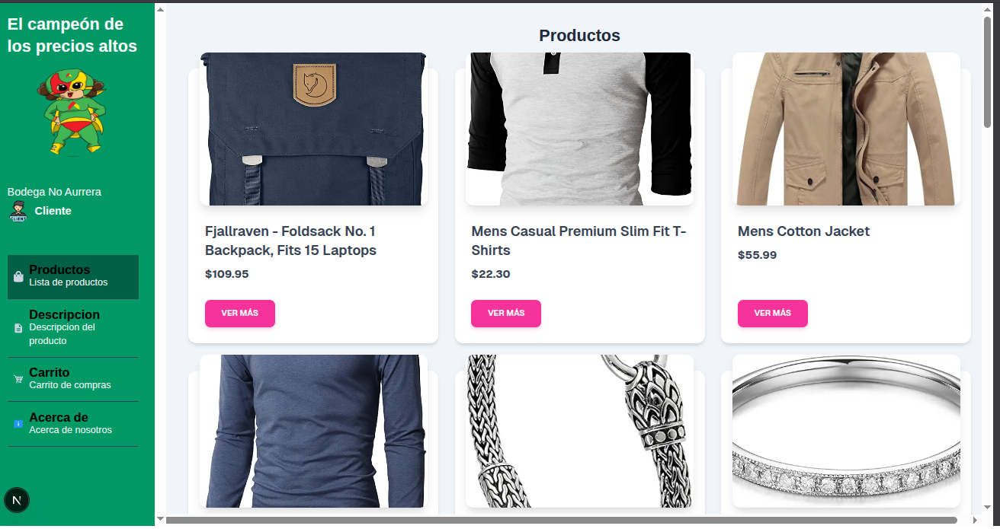
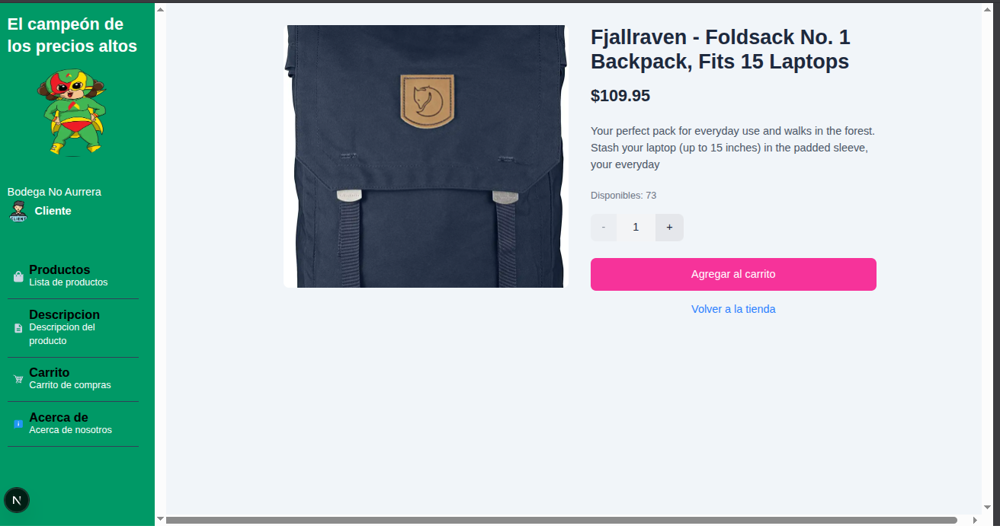
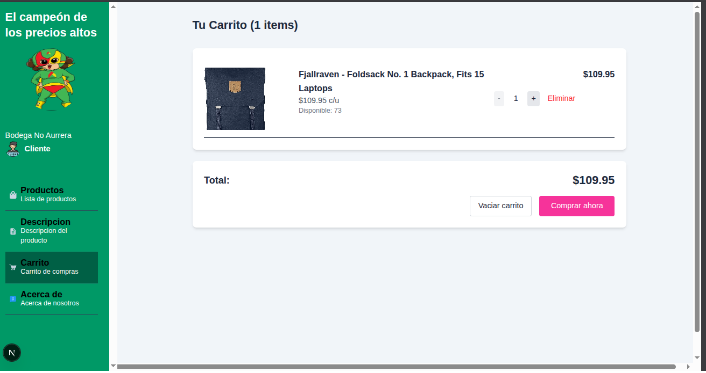

# 🛒 Bodega no Aurrera - Next.js + MySQL + Docker

Este es un sistema de tienda en línea desarrollado con **Next.js** y conectado a una **base de datos MySQL** mediante una **API personalizada**. El proyecto está listo para ejecutarse en contenedores gracias a **Docker**, facilitando su despliegue y desarrollo local.

---

## 🚀 Características

- 🔎 **Catálogo de productos**: Consulta todos los productos disponibles desde la base de datos.
- 📦 **Detalles del producto**: Puedes ver información detallada de cada producto (nombre, precio, descripción, imagen, stock, etc.).
- 🛒 **Carrito de compras**:
  - Agrega productos al carrito.
  - Ajusta la **cantidad** de cada producto.
  - Añade múltiples productos.
- ✅ **Simulación de compra**:
  - Al confirmar la compra, se descuenta el stock correspondiente en la base de datos MySQL.
  - El sistema verifica disponibilidad antes de procesar.

---

## 🧱 Tecnologías utilizadas

- **Next.js** (Frontend + Backend API)
- **MySQL 8.0** (Base de datos relacional)
- **Docker Compose** (para orquestar los servicios)
- **phpMyAdmin** (para administrar la base de datos desde el navegador)

---

## 🐳 Docker (Desarrollo Local)

### Requisitos:

- Docker
- Docker Compose

### 🔧 Iniciar el proyecto:

```bash
docker-compose up --build
```
Esto levantará:

- mysql en el puerto 3306

- phpMyAdmin en http://localhost:8080

- Next.js en http://localhost:3000

---
## 📸 Capturas

### 📦 Catálogo


### ✅ Descripción


### 🛒 Carrito de compras


---
## 📄 Licencia
Este proyecto es de uso libre para fines educativos o personales.
